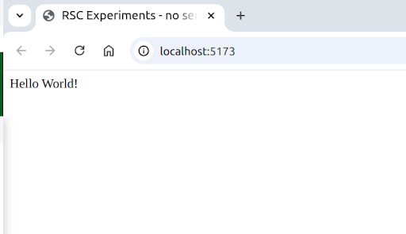
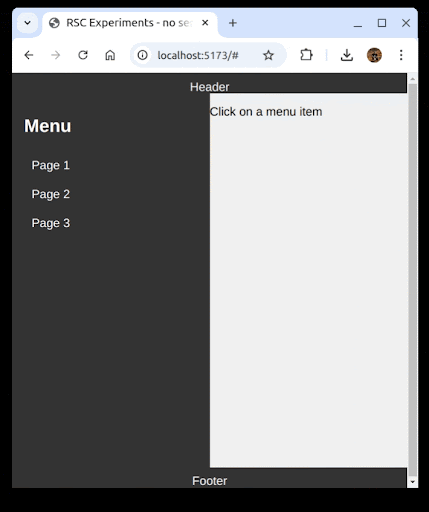
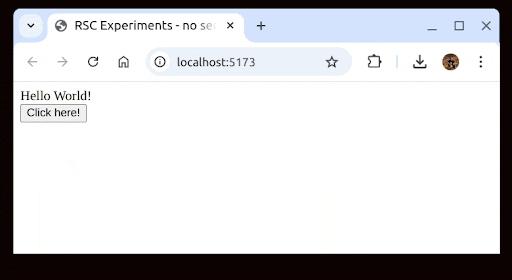
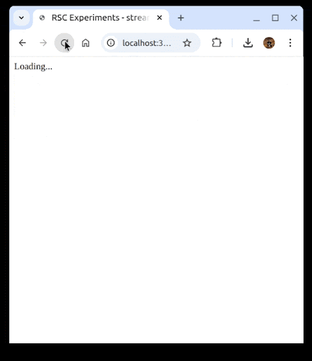

---
# You can also start simply with 'default'
theme: default
# random image from a curated Unsplash collection by Anthony
# like them? see https://unsplash.com/collections/94734566/slidev
# background: https://cover.sli.dev
# some information about your slides (markdown enabled)
title: Meet React Flight and become a RSC expert
info: |
  ## Slidev Starter Template
  Presentation slides for developers.

  Learn more at [Sli.dev](https://sli.dev)
# apply unocss classes to the current slide
class: text-left
# https://sli.dev/features/drawing
drawings:
  persist: false
# slide transition: https://sli.dev/guide/animations.html#slide-transitions
transition: slide-left
# enable MDC Syntax: https://sli.dev/features/mdc
mdc: true
# take snapshot for each slide in the overview
overviewSnapshots: true
---

<style>
  .slidev-page {
    background-color: #00517c;
  }
</style>

<div class="pt-12">
  
  
  <div class="mx-80 w-140 -my-50 color-white">
    <v-click>Hi, my name is Mauro, and I work as a software developer for doubleloop srl.<br/></v-click>
    <v-click>In my company, fridays are dedicated to exploration.<br/></v-click>
    <v-click>One of those was dedicated to RSC.<br/></v-click>
    <v-click>The exploration went through a set of challenges, with the goal of learning as much as possible.<br/></v-click>
    <v-click>This talk is about this learning journey.<br/></v-click>
  </div>
</div>

<!--
-->


---
class: text-center pt-50
transition: fade
---

<style>
h1 {
  color: white;
}
h2 {
  color: #87c25b;
}
hr {
  border: solid 2px #87c25b;
}

</style>

# Meet React Flight

<hr class="w-10 ml-100 mb-5"/>

## and become a Rsc Expert

---
class: text-center pt-50
---

# Discover RSC "real" meaning(s)

<hr class="w-10 ml-100 mb-5"/>

## Enjoy your flight!

---
class: pt-20
---

# Some links to useful materials

<hr class="w-10 ml-100 mb-5"/>

<span class="text-size-xl color-white">Repository used during the talk: https://github.com/mbarto/rsc-experiments</span>


---
class: text-center pt-40 color-white
---

# 1st Challenge

<hr class="w-10 ml-100 mb-5"/>

## Can we use RSC without a server?

<hr class="w-10 ml-100 mt-5 mb-5"/>

# React Server(less) Components

---

<v-click hide>

</v-click>
<div class="absolute right-10 w-110 color-white" v-after>
  <h3 class="mb-5">Learnings</h3>
  <span>We can render "pre-cooked" content by:</span>
  <ul>    
    <li v-click="2">fetching it from a file / string</li>
    <li v-click="3">invoking createFromFetch to get a Promise of a React Tree to be rendered</li>
    <li v-click="4">resolving the async Promise via the use hook, that hides the asynchronicity</li>
    <li v-click="5">rendering the React Tree via createRoot(...).render</li>
    <li v-click="7">Pre-cooked content is a serialized version of a React Tree, using a new protocol called React Flight.</li>
  </ul>
</div>

<div class="mt-4 w-100">

```js {*|7|3-8|1,11|14-15,2|7}
import { use } from "react";
import { createRoot } from "react-dom/client";
import { createFromFetch } from 
  "react-server-dom-esm/client";

const initialContent = createFromFetch(
  fetch("rsc/main.rsc")
);

function Root() {
  return use(initialContent);
}

createRoot(document.getElementById("root"))
  .render(<Root />);

```
</div>

<div class="mt-20 w-100" v-click>

```json
0:["$","div",null,{"children":"Hello World!"}]
```
<arrow x1="150" y1="190" x2="150" y2="430" color="#953" width="2" arrowSize="1" />
</div>

---
class: text-center mt-10
---

```mermaid {markdownAutoWrap: false}
flowchart TD
  A@{shape: circle, label: "React Tree"}
  B@{img: "./rsc_payload_1.png", w: 350, constraint: "on"}
  A -- Serialize (???) --> B
  B -- Deserialize (createFromFetch) --> HTML[&lt;div&gt;Hello World!&lt;/div&gt;]
```

---
layout: two-cols-header
class: text-center
---

<style>
  .col-header {
    font-size: 32px;
    color: white;
  }
</style>

<div class="text-center">What can we do with our learnings?</div>

::left::

# SSG

## Static Site Generation

::right::

<ul class="color-white text-left">    
    <li>Why not using HTML?</li>
    <li v-click>Flight is more expressive (data, promises, etc.)</li>
    <li v-click>Use it if you need its richness</li>
</ul>

---
class: text-center pt-40 color-white
---


# 1st Challenge

<hr class="w-10 ml-100 mb-5"/>

## Can we use RSC without a server?

<hr class="w-10 ml-100 mt-5 mb-5"/>

# React Server(less) Components

---
class: text-center pt-40 color-white
---

# 2nd Challenge

<hr class="w-10 ml-100 mb-5"/>

## Can we navigate different pages with RSC?

<hr class="w-10 ml-100 mt-5 mb-5"/>

# Replaceable Static Content

---

<v-click hide>

</v-click>
<div class="absolute right-10 w-90 color-white" v-after>
  <h3 class="mb-5">Learnings</h3>
  <span>We can replace content of the full page, or part of it by:</span>
  <ul>    
    <li v-click="2">storing content promise(s) into React state</li>
    <li v-click="3">updating the state as we fetch new content</li>
    <li v-click="4">passing content promise(s) as a  property of the component(s)</li>
  </ul>
  <span v-click="5">React Flight is a rich protocol, it supports:</span>
  <ul>    
    <li v-click="6">React Trees ($)</li>
    <li v-click="7">(Server) components</li>
    <li v-click="8">Many chunks, identified by keys (1, 2, 3, 0)</li>
    <li v-click="9">References to other chunks ($2, $3)</li>
  </ul>
  
</div>

<div class="w-120">
````md magic-move {lines: false}
```js {*|4|6-10|1}
function Root({ content }) => use(content);

function Layout() {
  const [pagePromise, setPagePromise] = useState(null);

  function setPage(page) {
    setPagePromise(
      createFromFetch(fetch(`rsc/page${page}.rsc`))
    );
  }

  return (
    <>
      <menu>
        <li>
          <a href="#" onClick={() => setPage(1)}>Page 1</a>
        </li>
      </menu>
      <Suspense fallback={<p>Loading...</p>}>
        <Root content={pagePromise} />
      </Suspense>
    </>
  );
}
createRoot(document.getElementById("root")).render(<Layout />);

```
```json {*|4|1|*}
1:{"name":"App","env":"Server","owner":null}
2:["$","h1",null,{"children":"Title"},"$1"]
3:["$","p",null,{"children":"Page1"},"$1"]
0:["$","div",null,{"children":["$2","$3"]},"$1"]
```
```json {2,3,5}
1:{"name":"App","env":"Server","owner":null}
2:["$","h1",null,{"children":"Title"},"$1"]
3:["$","p",null,{"children":"Page1"},"$1"]
0:["$","div",null,{"children":[
  "$2","$3"
]},"$1"]
```
````
</div>

---
layout: two-cols-header
class: text-center
---
<style>
  .col-header {
    font-size: 32px;
    color: white;
  }
</style>

<div class="text-center">What can we do with our learnings?</div>

::left::

# Page Navigation

## Replace Updated Content

::right::

<ul class="color-white text-left">    
    <li>Why not using HTML?</li>
    <li v-click>Not a strong reason to use RSC in this case</li>
</ul>

---
class: text-center pt-40 color-white
---


# 2nd Challenge

<hr class="w-10 ml-100 mb-5"/>

## Can we navigate different pages with RSC?

<hr class="w-10 ml-100 mt-5 mb-5"/>

# Replaceable Static Content

---
class: text-center pt-40 color-white
---

# 3rd Challenge

<hr class="w-10 ml-100 mb-5"/>

## Can we split rendering between a server and a client with RSC?

<hr class="w-10 ml-100 mt-5 mb-5"/>

# React Server<small>(and)</small>Client

---


<div class="absolute right-10 w-90 color-white">
  <h3 class="mb-5">Learnings</h3>
  <span>We need a condition on the starting script to enable react in server mode<br/></span>
  <span v-click="1">We can "pre-cook" content on a server by:</span>
  <ul>    
    <li v-click="2">creating a /rsc endpoint</li>
    <li v-click="3">invoking renderToPipeableStream on a (server) component</li>
    <li v-click="4">"pipeing" the result on the backend response object</li>
  </ul>
  <span v-click="5">The server components have some limitations:</span>
  <ul>    
    <li v-click="6">can't use any of the usual hooks, to manage state</li>
    <li v-click="7">can't use context either</li>
    <li v-click="8">this is because they are, by design, stateless</li>
  </ul>
  
</div>

<div class="w-120 mt-10">
```sh
node --conditions=react-server server.js
```
</div>

<div class="w-120" v-click="1">
```js {*|*|12-15|13|14|*}
import Fastify from "fastify";
import { renderToPipeableStream } 
  from "react-server-dom-esm/server";

function App() => <div>Hello world!</div>;

export async function main() {
  const server = Fastify();

  server.get("/", (_, reply) => reply.html();

  server.get("/rsc", (_, reply) => {
    const { pipe } = renderToPipeableStream(<App/>);
    pipe(reply.raw);
  });

  return server;
}

const server = await main();
await server.listen({ port: 3000 });
```
</div>

---
class: text-center mt-10
---

```mermaid {markdownAutoWrap: false}
flowchart TD
  A@{shape: circle, label: "React Tree"}
  B@{img: "./rsc_payload_1.png", w: 350, constraint: "on"}
  A -- Serialize (renderToPipeableStream) --> B
  B -- Deserialize (createFromFetch) --> HTML[&lt;div&gt;Hello World!&lt;/div&gt;]
```
---

<v-click hide>

</v-click>

<div class="absolute right-10 w-90 color-white" v-after>
  <h3 class="mb-5">Learnings</h3>
  <ul>    
    <li v-click="2">Client (only) components can be created using the directive use client.</li>
    <li v-click="3">We can use client components in server components, not the other way around</li>
    <li v-click="4">Client components are translated into an import chunk (I)...</li>
    <li v-click="5">...and one ore more lazy references ($L) by React Flight</li>
  </ul>
</div>

<div class="w-120">
```js {*|1}
"use client";

export const MyClientComponent = ({ content }) =>
  <button onClick={() => alert("Clicked!")}>{content}</button>;
```
</div>

<div class="w-120">
```js {*|9}
import Fastify from "fastify";
import { renderToPipeableStream } 
  from "react-server-dom-esm/server";
import { MyClientComponent } 
  from "./client/my-client-component.js"

function App() => (<div>
  <h1>Hello world!</h1>
  <MyClientComponent content="Click me!"/>
</div>);

export async function main() {
  ...
  server.get("/rsc", (_, reply) => {
    const basePath = new URL("./client", import.meta.url).href;
    const { pipe } = renderToPipeableStream(<App/>, basePath);
    pipe(reply.raw);
  });
  return server;
}
```
</div>

<div class="absolute w-100 bottom-10 right-10">
```json {*|1|4}
a:I["/my-client-component.js","MyClientComponent"]
0:["$","div",null,{"children":[
  ["$", "div", null, {"children": "Hello World!"}], 
  ["$", "$La", "a", {"content": "Click here!"}]]}
]
```
</div>
---

<div class="absolute right-10 w-90 color-white">
  <h3 class="mb-5">Learnings</h3>
  <ul>    
    <li v-click="1">renderToPipeableStream needs an additional parameter to resolve client components path</li>
    <li v-click="2">on the client side, we need the same in createFromFetch</li>
    <li v-click="3">a custom loader, or a bundler,  is needed on the backend to handle client components</li>
  </ul>
</div>

<div class="w-120">
```js {*|15-16}
import Fastify from "fastify";
import { renderToPipeableStream } 
  from "react-server-dom-esm/server";
import { MyClientComponent } 
  from "./client/my-client-component.js"

function App() => (<div>
  <h1>Hello world!</h1>
  <MyClientComponent content="Click me!"/>
</div>);

export async function main() {
  ...
  server.get("/rsc", (_, reply) => {
    const basePath = new URL("./client", import.meta.url).href;
    const { pipe } = renderToPipeableStream(<App/>, basePath);
    pipe(reply.raw);
  });
  return server;
}
```

```js {*|3}
const initialContent = createFromFetch(
  fetch("/rsc", {
    moduleBaseURL: window.location.origin
  })
)
```
</div>

<div class="absolute w-90 bottom-10 right-10">
```sh {none|1}
node --import ./register-rsc-loader.js ...
```
```js {none|*}
import { load as reactLoad } 
  from "react-server-dom-ems/node-loader";
...
```
</div>

---
layout: two-cols-header
class: text-center
---
<style>
  .col-header {
    font-size: 32px;
    color: white;
  }
</style>

<div class="text-center">What can we do with our learnings?</div>

::left::

# SSR

## Server Side Rendering

::right::

<ul class="color-white text-left">    
    <li>renderToString --> HTML</li>
    <li v-click>renderToPipeableStream --> RSC</li>
    <li v-click>Still nothing really impressive...</li>
</ul>

---
class: text-center pt-40 color-white
---


# 3rd Challenge

<hr class="w-10 ml-100 mb-5"/>

## Can we split rendering between a server and a client with RSC?

<hr class="w-10 ml-100 mt-5 mb-5"/>

# React Server<small>(and)</small>Client

---
class: text-center pt-40 color-white
---

# 4th Challenge

<hr class="w-10 ml-100 mb-5"/>

## Can we stream (infinite) content with RSC?

<hr class="w-10 ml-100 mt-5 mb-5"/>

# React Streaming Components

---

<v-click hide>

</v-click>

<div class="absolute right-10 w-90 color-white" v-after v-click.hide="5">
  <h3 class="mb-5">Learnings</h3>
  <span>We can create async (server) components by:</span>
  <ul>    
    <li v-click="2">using async / await as needed</li>
    <li v-click="3">using Suspense to wrap an async component and define a fallback to show until the component is resolved</li>
    <li v-click="4">We can even use the same component recursively to create a (potentially) infinite content stream</li>
  </ul>
</div>

<div class="absolute right-10 w-90 color-white" v-click="5">
  <h3 class="mb-5">Learnings</h3>
  <span>React Flight supports streaming content by:</span>
  <ul>    
    <li v-click="6">allowing serialization of React internal components (e.g. Suspense) through symbols ($S)</li>
    <li v-click="7">referencing future content as lazy content ($L)</li>
    <li v-click="8">renderToPipeableStream streams new content (in chunks), when it is available</li>
  </ul>
</div>

<div class="w-120">
```js {*|1-2|5|6,14}
async function Async({ counter }) {
  await new Promise((r) => setTimeout(r, 1000));
  return (<>
    <p>Counter: {counter}</p>
    <Suspense fallback="Loading...">
      <Async counter={counter + 1}/>
    </Suspense>
  </>);
}

function App() {
  return (<div>
    <Suspense fallback="Loading...">
      <Async counter={0}/>
    </Suspense>
  </div>);
}

```
</div>


<div class="absolute w-220 bottom-10 left-10" v-click="5">
```json {*|*|1|3|5}
2:"$Sreact.suspense"
0:["$","div",null,{"children":["$","$2",null,{"fallback":"Loading...","children":
  "$L3"
},"$1"]},"$1"]
3:[["$","p",null,{"children":"Counter: 0"},null],["$","$2",null,{"fallback":"Loading...","children": "$L5"},null]]
```
</div>

---
layout: two-cols-header
class: text-center
---
<style>
  .col-header {
    font-size: 32px;
    color: white;
  }
</style>

<div class="text-center">What can we do with our learnings?</div>

::left::

# Streaming Content

## Slow and Fast Content

::right::

<ul class="color-white text-left">    
    <li>HTML does not (easily) support streaming content</li>
    <li v-click>This is a real game changer!</li>
</ul>

---
class: text-center pt-40 color-white
---


# 4th Challenge

<hr class="w-10 ml-100 mb-5"/>

## Can we stream (infinite) content with RSC?

<hr class="w-10 ml-100 mt-5 mb-5"/>

# React Streaming Components