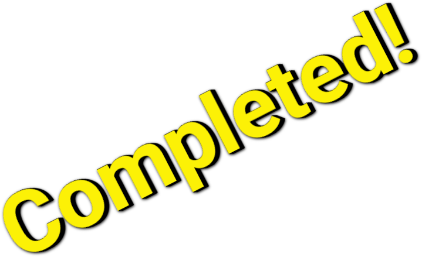

---
# You can also start simply with 'default'
theme: default
# random image from a curated Unsplash collection by Anthony
# like them? see https://unsplash.com/collections/94734566/slidev
# background: https://cover.sli.dev
# some information about your slides (markdown enabled)
title: Introduction
info: |
  ## Slidev Starter Template
  Presentation slides for developers.

  Learn more at [Sli.dev](https://sli.dev)
# apply unocss classes to the current slide
class: text-left
# https://sli.dev/features/drawing
drawings:
  persist: false
# slide transition: https://sli.dev/guide/animations.html#slide-transitions
transition: slide-left
# enable MDC Syntax: https://sli.dev/features/mdc
mdc: true
# take snapshot for each slide in the overview
overviewSnapshots: true
---

<style>
  .slidev-page {
    background-color: #00517c;
  }
</style>

<div class="pt-12">
  
  
  <div class="mx-80 w-140 -my-50 color-white">
    <v-click>Hi, my name is Mauro, and I work as a software developer for doubleloop srl.<br/></v-click>
    <v-click>In my company, fridays are dedicated to exploration.<br/></v-click>
    <v-click>One of those was dedicated to RSC.<br/></v-click>
    <v-click>The exploration went through a set of challenges, with the goal of learning as much as possible.<br/></v-click>
    <v-click>This talk is about this learning journey.<br/></v-click>
  </div>
</div>

<!--
-->


---
class: text-center pt-50
transition: fade
---

<style>
h1 {
  color: white;
}
h2 {
  color: #87c25b;
}
hr {
  border: solid 2px #87c25b;
}

</style>

# Meet React Flight

<hr class="w-10 ml-100 mb-5"/>

## and become a Rsc Expert

---
class: text-center pt-50
---

# Discover RSC "real" meaning(s)

<hr class="w-10 ml-100 mb-5"/>

## Enjoy your flight!

---
class: pt-20
---

# Some links to useful materials

<hr class="w-10 ml-100 mb-5"/>

<span class="text-size-xl color-white">Repository used during the talk: <a href="https://github.com/mbarto/rsc-experiments" target="_blank">https://github.com/mbarto/rsc-experiments</a></span>


---
class: text-center pt-40 color-white
---

# 1st Challenge

<hr class="w-10 ml-100 mb-5"/>

## Can we use RSC without a server?

<hr class="w-10 ml-100 mt-5 mb-5"/>

# React Server(less) Components

---
class:
---

<v-click hide>

</v-click>
<div class="absolute right-10 w-110 color-white" v-after>
  <h3 class="mb-5">Learnings</h3>
  <span>We can render "pre-cooked" content by:</span>
  <ul>    
    <li v-click="2">fetching it from a file / string</li>
    <li v-click="3">invoking createFromFetch to get a Promise of a React Tree to be rendered</li>
    <li v-click="4">resolving the async Promise via the use hook, that hides the asynchronicity</li>
    <li v-click="5">rendering the React Tree via createRoot(...).render</li>
    <li v-click="7">Pre-cooked content is a serialized version of a React Tree, using a new protocol called React Flight.</li>
  </ul>
</div>

<div class="mt-4 w-100">

```js {*|7|3-8|1,11|14-15,2|7}
import { use } from "react";
import { createRoot } from "react-dom/client";
import { createFromFetch } from 
  "react-server-dom-esm/client";

const initialContent = createFromFetch(
  fetch("rsc/main.rsc")
);

function Root() {
  return use(initialContent);
}

createRoot(document.getElementById("root"))
  .render(<Root />);

```
</div>

<div class="mt-20 w-100" v-click>

```json
0:["$","div",null,{"children":"Hello World!"}]
```
<arrow x1="150" y1="190" x2="150" y2="430" color="#953" width="2" arrowSize="1" />
</div>

---
class: text-center mt-10
---

```mermaid {markdownAutoWrap: false}
flowchart TD
  A@{shape: circle, label: "React Tree"}
  B@{img: "./rsc_payload_1.png", w: 350, constraint: "on"}
  A -- Serialize (???) --> B
  B -- Deserialize (createFromFetch) --> HTML[&lt;div&gt;Hello World!&lt;/div&gt;]
```

---
layout: two-cols-header
class: text-center
---

<style>
  .col-header {
    font-size: 32px;
    color: white;
  }
</style>

<div class="text-center">What can we do with our learnings?</div>

::left::

# SSG

## Static Site Generation

::right::

<ul class="color-white text-left">    
    <li>Why not using HTML?</li>
    <li v-click>Flight is more expressive (data, promises, etc.)</li>
    <li v-click>Use it if you need its richness</li>
</ul>

---
class: text-center pt-40 color-white
---



# 1st Challenge

<hr class="w-10 ml-100 mb-5"/>

## Can we use RSC without a server?

<hr class="w-10 ml-100 mt-5 mb-5"/>

# React Server(less) Components

